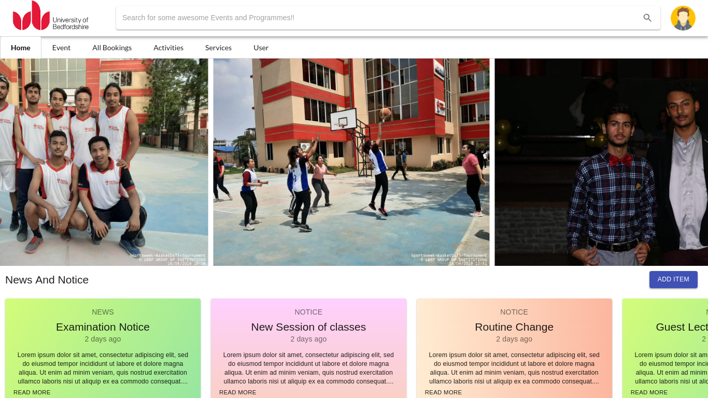
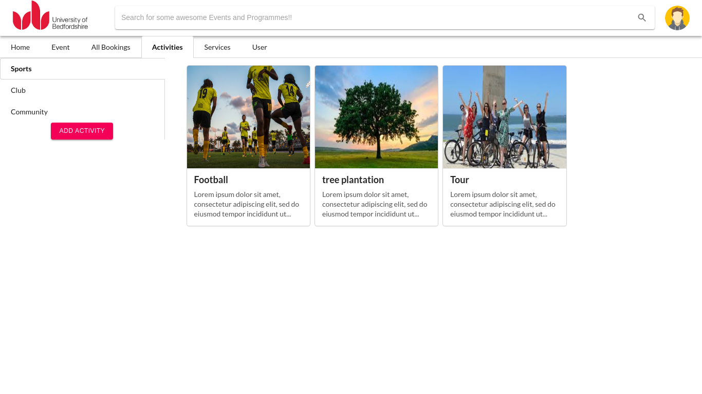

# Electron-KIOSK

A React Electron based KIOSK application for student information management.

# Tools Used
> Electron-Forge (React Template) of ElectronJS
> ExpressJS for the <a href="https://github.com/kirandroid/KIOSK-API" target="_blank">RestAPI</a>
> Oracle for the Database
> Material-UI and Semantic UI for User Inteface

## Some Screenshots

     
