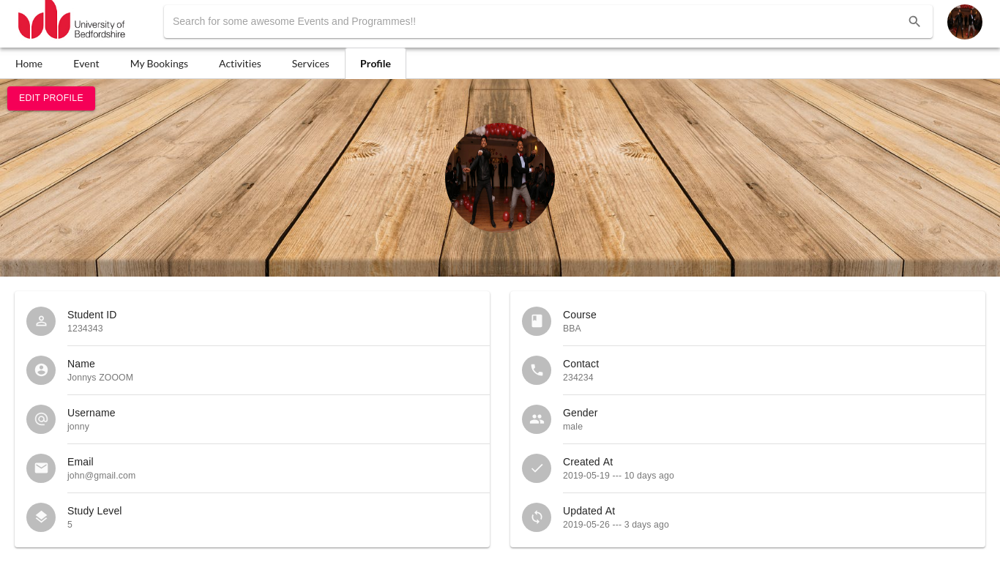
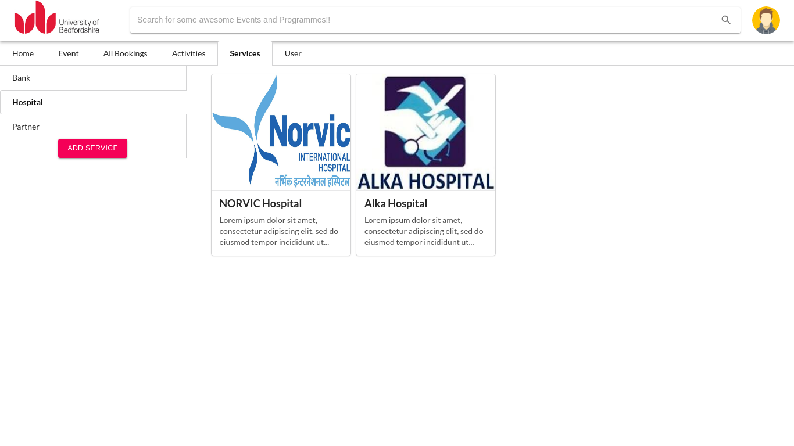

# Electron-KIOSK

A React Electron based KIOSK application for student information management.

# Tools Used
> 1. Electron-Forge (React Template) of ElectronJS
> 2. ExpressJS for the <a href="https://github.com/kirandroid/KIOSK-API" target="_blank">RestAPI</a>
> 3. Oracle for the Database
> 4. Material-UI and Semantic UI for User Inteface

### Installation

This project requires the [KIOSK API](https://github.com/kirandroid/KIOSK-API) to run.

```sh
$ git clone https://github.com/kirandroid/Electron_KIOSK.git
$ cd Electron_KIOSK
$ npm install
$ electron-forge start
```

## Some Screenshots

     
